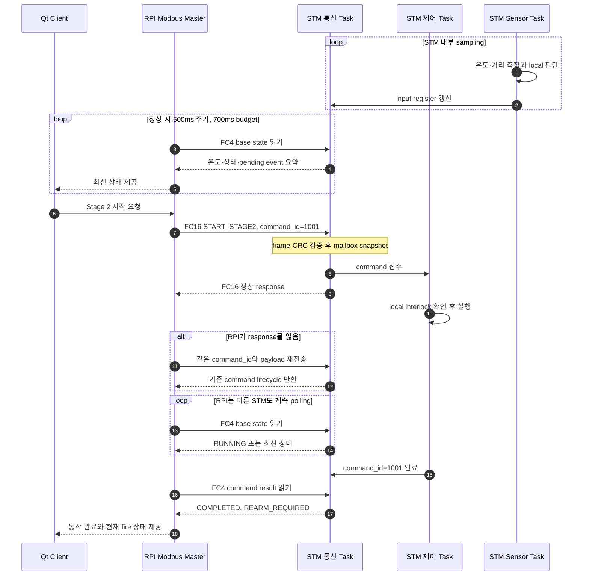

# RPI–STM 프로토콜 설계 및 운용 가이드

## 1. 문서 목적과 우선순위

이 문서는 RPI VMS와 STM32 사이의 통신 방식을 선택한 이유, timing 계산, polling과
command·event 처리 흐름을 설명한다. 처음 참여한 팀원이 전체 구조와 운용 의도를
빠르게 파악하기 위한 비규범 가이드이다.

규범 자료의 우선순위는 다음과 같다.

1. [`stm_protocol.h`](stm_protocol.h): 주소, bit, opcode, 단위와 codec의 최종 기준
2. [RPI–STM 인터페이스 명세](rpi-stm-interface.md): wire field 의미와 동작 규칙
3. 이 문서: 설계 이유, 계산, 예시와 운용 지침

주소·register 표는 중복으로 복사하지 않는다. 값이 필요하면 공용 header와 인터페이스
명세를 확인한다.

## 2. 한눈에 보는 결정

```text
Physical layer     RS-485 2-wire half-duplex
Bus owner          RPI master
STM behavior       요청받은 slave만 응답
UART               19200 8E1
Frame              Modbus RTU
Application        표준 FC4/FC16 위의 프로젝트 전용 register map
CRC                Modbus CRC16, low byte first
Register order     16-bit register high byte first
Multi-register     high register first
Protocol version   0.2
```

RPI는 bus의 유일한 master로서 polling과 command 순서를 결정한다. STM은 master의 요청
없이 송신하지 않으며 sensor sampling, local 판단과 actuator interlock을 독립적으로
수행한다.

## 3. 통신 방식 선정

### I²C를 사용하지 않은 이유

I²C는 주소 기반으로 여러 장치를 연결할 수 있지만 open-drain bus의 rise time이 pull-up
저항과 bus capacitance의 영향을 받는다. 별도 buffer·extender를 사용하면 거리를 늘릴
수 있으나, 주차장 규모의 수십~수백 m 현장 배선을 위한 기본 field bus로 사용하기에는
배선 capacitance와 noise margin 관리가 복잡하다. I²C에는 모든 구성에 적용되는 단일
최대 거리값이 없으므로 단순히 "몇 m 이상 사용 불가"라고 표현하지 않는다.

근거: [NXP I²C-bus specification and user manual UM10204](https://www.nxp.com/docs/en/user-guide/UM10204.pdf)

### Zigbee를 선택하지 않은 이유

Zigbee는 commercial building에도 사용되는 self-healing mesh 기술이므로 지하주차장이라는
이유만으로 부적합하다고 단정하지 않는다. 다만 실제 지하주차장에서는 콘크리트·금속
구조물과 차량에 따른 RF 음영, router 배치, site survey, pairing·mesh·security 운영을
추가로 관리해야 한다.

이 프로젝트는 장치에 전원과 배선을 제공할 수 있고, prototype에서 RF망 운영보다
유선 bus의 예측 가능한 경로와 단순한 장애 분석을 우선했으므로 Zigbee를 채택하지
않았다.

근거: [Connectivity Standards Alliance Zigbee](https://csa-iot.org/all-solutions/zigbee/)

### RS-485를 선택한 이유

RS-485는 differential signaling과 multipoint bus를 제공하여 여러 STM을 하나의 유선
trunk에 연결하는 구조에 적합하다. EIA-485는 BACnet MS/TP 등 건물 자동화 통신에서도
사용되는 확립된 전송 매체다. 이 사실은 특정 cable 길이와 baud에서 통신 성공을
보장한다는 의미가 아니며 실제 배포 구성은 별도로 시험한다.

근거:

- [ASHRAE BACnet resource](https://data.ashrae.org/BACnet/)
- [BACnet MS/TP over EIA-485 설명](https://www.ashrae.org/File%20Library/Technical%20Resources/Bookstore/BACnet-explained-Pt1.pdf)

STM UART와 RS-485 bus 사이에는 UART logic level을 differential A/B 신호로 변환하고
driver enable을 제어하는 RS-485 transceiver 또는 module을 사용한다.

### Modbus RTU를 선택한 이유

Modbus Serial Line은 master-slave transaction, slave address, function code, RTU frame과
CRC를 정의한다. 공식 가이드는 2-wire EIA/TIA-485를 일반적인 물리 interface로
설명한다. 기존 library·분석 도구·시험기의 framing과 CRC를 재사용할 수 있으므로 별도
serial protocol을 처음부터 만들지 않았다.

이 프로젝트는 Modbus RTU 위에 별도 frame을 중첩하지 않는다. 표준 FC4와 FC16을
사용하고, application data만 프로젝트 전용 register map과 enum으로 정의한다.

근거:

- [Modbus Serial Line Protocol and Implementation Guide V1.02](https://www.modbus.org/file/secure/modbusoverserial.pdf)
- [Modbus Application Protocol V1.1b3](https://www.modbus.org/file/secure/modbusprotocolspecification.pdf)

## 4. `19200 8E1` 선정 근거

설계 시 확인한 규모는 개발 최대 5대, 실제 제작 1~2대, protocol 설계 상한 20대다.
주차면당 최대 약 20m를 가정하면 20대 trunk는 약 400m가 된다.

`8E1`은 start 1bit, data 8bit, even parity 1bit, stop 1bit로 character당 총 11bit다.
STM32F401은 parity를 peripheral word length에 포함하므로 CubeMX/HAL에서는 9-bit word
length, even parity, 1 stop bit로 설정하여 wire의 data 8bit를 보존한다.

base state를 FC4 request 8bytes, 6-register response 17bytes, STM frame detection 5ms,
나머지 처리·gap 3ms, retry 없음으로 계산한 planning 값은 다음과 같다.

| Baud | request+response wire | 장치당 transaction | 20-node sweep |
| ---: | ---: | ---: | ---: |
| 9,600 | 약 28.6ms | 약 36.6ms | 약 733ms |
| 19,200 | 약 14.3ms | 약 22.3ms | 약 447ms |
| 115,200 | 약 2.4ms | 약 10.4ms | 약 208ms |

`19200`은 `9600`보다 20대 scan 여유를 확보하면서 장거리 prototype에서 `115200`보다
보수적인 timing margin을 두기 위한 기준값이다. 위 표는 payload와 scheduler를 설계하기
위한 계산값이며 실제 cable·transceiver·adapter·node loading에서의 성능 보장이 아니다.

RS-485의 지원 거리는 cable 저항과 특성 임피던스, transceiver, node loading, stub,
termination, ground potential과 noise에 따라 달라진다. 따라서 짧은 개발 cable의 성공을
400m 또는 1km 합격으로 해석하지 않는다.

## 5. Timing과 polling 근거

### Response timeout `50ms`

초기 설계값은 `30ms`였으나 실내 개발 환경의 약 2.5m 연결에서 1회 왕복을 측정한 결과
약 `36ms`가 확인되었다. 정상 통신을 timeout으로 오분류하지 않도록 여유를 더하여
공용 기준을 `50ms`로 확정하였다.

이 값은 현재 protocol 시험과 개발 시험기의 기본값이다. cable 길이, USB–RS-485
adapter, 방향 전환 지연이나 node 구성이 달라지면 반복 측정하여 재검토한다.

### Base poll `500ms`와 scheduler budget `700ms`

같은 STM의 base poll 시작 간격은 최소 `500ms`다. 정상 20-node sweep의 planning 값
약 `447ms`를 기준으로 잡고, Linux scheduling과 추가 transaction의 여유를 포함한 한
cycle의 목표 상한을 `700ms`로 둔다.

`700ms`는 현재 진행 중인 RTU transaction이나 physical bus jam을 강제로 중단하는
hard deadline이 아니다. 20대 전체 구성의 배포 환경 실측이 끝나기 전에는 목표값으로
취급한다.

```text
next_sweep_start =
  max(previous_sweep_start + 500ms, previous_sweep_finish)
```

- 1대: planning transaction 약 22ms 후 약 478ms 대기
- 5대: planning sweep 약 112ms 후 약 388ms 대기
- 20대: planning sweep 약 447ms 후 약 53ms 대기
- 500ms를 넘긴 sweep: 중첩 생성 없이 완료 직후 다음 sweep 시작

## 6. Read와 write 경로

### State read path

RPI는 FC4로 각 STM의 base state를 읽는다. base state는 정상 cycle마다 필요한 온도,
validity, 점유·화재·actuator 상태와 pending event 요약을 제공한다. identity, sensor
detail과 event status는 연결·진단 또는 flag가 필요한 경우에만 추가로 읽는다.

STM은 sensor sampling과 local 판단을 polling과 독립적으로 계속 수행한다. RPI가 한
STM의 actuator 완료를 기다리는 blocking loop를 만들지 않으므로 다른 STM의 상태
확인이 중단되지 않는다.

### Control write path

RPI는 FC16으로 고정 길이 command mailbox를 쓴다. STM 통신 task는 frame 전체와 CRC를
검증한 후 mailbox를 한 번 snapshot하여 control queue로 넘긴다.

FC16 정상 response는 register write 완료를 의미하며 actuator 완료를 의미하지 않는다.
RPI는 이후 FC4 command result에서 `ACCEPTED`, `RUNNING`, `COMPLETED`, `FAILED` 또는
`REJECTED`를 확인한다.

통신 response를 잃으면 동일한 `command_id`와 동일한 payload를 재전송한다. STM은 이미
접수한 ID를 다시 실행하지 않고 기존 lifecycle 결과를 반환한다. 같은 ID에 다른
payload가 오면 `ID_CONFLICT`로 거부한다.

## 7. Polling과 장애 처리

RPI scheduler는 다음 우선순위를 사용한다.

1. 현재 RTU transaction 직후 새 actuator command 전송
2. 모든 STM의 base state sweep
3. pending critical event 읽기와 ACK
4. 동작 중 actuator의 추가 상태 확인
5. identity·sensor detail·configuration 진단

CRC 오류나 timeout은 같은 node에서 즉시 반복하지 않는다.

1. base sweep에서 node당 한 번 시도한다.
2. 실패 frame을 폐기하고 다음 node로 진행한다.
3. 전체 sweep 뒤 `700ms` budget이 남을 때만 실패 node를 재시도한다.
4. 연속 실패 node는 offline으로 판정하고 `1000ms` 주기의 probe 대상으로 전환한다.
5. 다시 유효한 response가 오면 identity와 `boot_session_id`를 확인한다.

이 정책은 고장난 한 node의 재시도보다 나머지 node의 상태 확인을 우선한다.

## 8. 전체 송수신 예시



GitHub Markdown에서는 Mermaid source를 기준으로 사용한다. Mermaid를 지원하지 않는
보고서·PDF·문서 시스템에 넣을 때만 SVG로 export하며, 수정 가능한 Mermaid 원문은
함께 보존한다.

## 9. Event와 ACK

STM은 event를 RAM queue에 보존하고 FC4 event window로 가장 오래된 미확인 event를
노출한다. RPI는 event를 영속 저장한 뒤 `ACK_EVENT`를 보낸다. ACK sequence가 현재
pending event와 일치할 때만 STM이 해당 event를 제거한다.

queue overflow가 발생하면 STM은 dropped count와 overflow flag를 유지한다. RPI는
이를 확인한 뒤 `ACK_EVENT_STATUS`를 보낸다. CRC 오류나 timeout으로 event를 읽지
못하면 ACK하지 않으므로 이후 scheduler 기회에 다시 읽을 수 있다.

STM RAM queue는 전원 손실을 견디는 nonvolatile log가 아니다. RPI에 전달하기 전에 STM
전원이 꺼지면 미전송 event가 유실될 수 있으며 prototype은 이 한계를 수용한다.

## 10. Reboot와 시각 동기화

RPI는 STM reboot를 확인하면 새 `boot_session_id`를 `ACK_RESTART`로 할당한 뒤 자신의
system clock이 NTP에 동기화된 경우 `SYNC_TIME`을 보낸다. STM은 수신 시점의 Unix epoch
seconds와 local monotonic tick을 RAM에 함께 저장한다.

event의 local tick을 UTC에 연결할 수 있지만 wire가 초 단위이므로 sub-second 손실과
전달 지연이 포함된다. millisecond 단위의 수신 latency는 RPI가 수집한 timestamp를
기준으로 판단한다. STM reboot 후 sync 이전 event는 absolute UTC로 단정하지 않는다.

## 11. 구현과 보안 경계

- 공용 header: `rpi-stm/stm_protocol.h`
- RPI runtime: `RPI-Server/src/stm`
- STM runtime: `stm32-ev-firmware`
- 개발 시험기: `rpi-stm/pi-tester/`

양쪽 runtime은 공용 header의 register 주소, enum과 packing helper를 사용한다. Modbus
RTU frame 직렬화와 CRC는 각 runtime의 Modbus 구현이 담당한다. C 구조체 메모리를
`packed` 처리하여 UART에 직접 보내지 않는다.

현재 prototype은 RS-485 배선을 신뢰 가능한 물리 영역으로 가정하며 message
authentication과 encryption을 제공하지 않는다. 물리적으로 bus에 접근할 수 있는
공격자는 slave address·UID 복제, command 위조 또는 replay를 시도할 수 있다. Qt–RPI
인증은 이 bus의 위조를 방지하지 않는다.

제품 단계에서 이 위험을 수용할 수 없다면 장치별 secret key, counter 또는 nonce와
HMAC/AES-CMAC 등의 command authentication을 별도 protocol version으로 설계한다.

## 12. 배포 전 확인

- 19200 8E1, polarity와 common 연결 확인
- trunk 양 끝 termination과 stub 길이 확인
- bias/fail-safe 구성 확인
- ground potential, isolation, surge·ESD 보호 검토
- 실제 cable·adapter·node 수에서 response time 반복 측정
- CRC·timeout·offline·재연결 시험
- 동일 `command_id` 재전송의 중복 실행 방지 시험
- STM reboot, `boot_session_id`와 `SYNC_TIME` 재설정 시험

